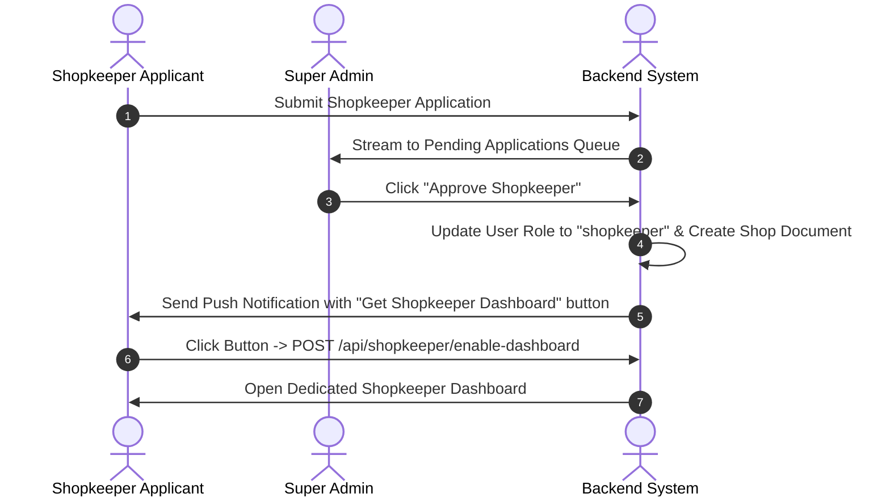

# 📖 Go2Pick - Comprehensive Project Documentation & Technical Specification

**System Name**: Go2Pick Hyperlocal Pre-Order & Pickup Platform  
**Version**: 1.0.0 Production MVP  
**Repository**: [https://github.com/Rajamaran-31/Go2Pick.git](https://github.com/Rajamaran-31/Go2Pick.git)  
**Live Application**: [https://go2-pick.vercel.app](https://go2-pick.vercel.app)  
**Last Updated**: September 2026  

---

## 📋 Table of Contents
1. [Project Overview & Core Vision](#1-project-overview--core-vision)
2. [Technology Stack & System Architecture](#2-technology-stack--system-architecture)
3. [Database Architecture & Data Models](#3-database-architecture--data-models)
4. [Authentication & Role-Based Access Control (RBAC)](#4-authentication--role-based-access-control-rbac)
5. [Complete REST API Specification](#5-complete-rest-api-specification)
6. [Frontend Structure & UI Component Map](#6-frontend-structure--ui-component-map)
7. [End-to-End User Workflows](#7-end-to-end-user-workflows)
8. [Local Development & Deployment Guide](#8-local-development--deployment-guide)

---

## 1. Project Overview & Core Vision

**Go2Pick** is a pickup-only local shop pre-order marketplace application. It empowers local retail businesses (groceries, bakeries, pharmacies) to digitize their inventory while enabling customers to pre-order daily essentials and pick them up in under 30 seconds without standing in long checkout queues.

### 🌟 Key Value Propositions
- **For Customers**: Zero waiting time in checkout queues, pre-packaged order readiness, real-time distance sorting, and secure 4-digit pickup code verification.
- **For Shopkeepers**: Zero-commission local digital presence, automated order pipeline management (`New` ➔ `Preparing` ➔ `Ready for Pickup`), inventory controls, and instant customer notifications.
- **For Super Admins**: 100% control over platform merchant approvals, user management, shop status controls, revenue metrics, and system audit logs.

---

## 2. Technology Stack & System Architecture

### 🖥️ Frontend (Admin Panel & Storefront)
- **Framework**: React 18 with Vite build system
- **Routing**: `react-router-dom` v6
- **Styling**: Vanilla Tailwind CSS + Glassmorphism UI tokens
- **Icons**: Google Material Symbols Outlined & FontAwesome icons
- **State Management**: React Context API (`AuthContext`, `AppContext`, `CartContext`)
- **HTTP Client**: Axios with centralized interceptors (`services/api.js`)

### ⚡ Backend (REST API)
- **Framework**: FastAPI (Python 3.11) with Uvicorn ASGI server
- **Validation**: Pydantic schemas & custom input validators
- **Database Persistence**: Dual persistence strategy:
  1. **Google Cloud Firestore**: Primary real-time database for users, applications, shops, orders, and notifications.
  2. **MongoDB Atlas**: Auxiliary database connected via PyMongo.
- **Push & Email Services**: Firebase Cloud Messaging (FCM) & SMTP Email Dispatch

---

## 3. Database Architecture & Data Models

### 🗄️ Collections / Schemas

#### 1. `users` Collection
| Field | Type | Description |
| :--- | :---: | :--- |
| `id` / `_id` | `String` | Unique user document ID or Firebase Auth UID |
| `fullName` | `String` | User full name |
| `email` | `String` | Unique email address |
| `phone` | `String` | Mobile phone number |
| `role` | `String` | Role (`customer`, `shopkeeper`, `super_admin`) |
| `isShopkeeper` | `Boolean` | True if user owns an approved shopkeeper account |
| `shopkeeperStatus` | `String` | Application status (`none`, `pending`, `approved`, `rejected`) |
| `shopkeeperDashboardEnabled` | `Boolean` | True if user unlocked shopkeeper dashboard |
| `activeShopId` | `String` | Linked shop ID (`shop-grany-groceries`) |
| `activeMode` | `String` | Active viewing mode (`customer` or `shopkeeper`) |
| `isBlocked` | `Boolean` | Account block status |

#### 2. `shops` Collection
| Field | Type | Description |
| :--- | :---: | :--- |
| `id` | `String` | Unique shop ID (`shop-grany-groceries`) |
| `name` / `shopName` | `String` | Business name |
| `ownerId` | `String` | User ID of the shopkeeper owner |
| `email` | `String` | Owner email address |
| `category` | `String` | Shop category (`grocery`, `pharmacy`, `bakery`) |
| `address` | `String` | Physical street address |
| `city` | `String` | City location |
| `pincode` | `String` | Postal code |
| `latitude` / `longitude` | `Float` | GPS coordinates for distance calculation |
| `isActive` | `Boolean` | Active operational status |
| `isApproved` | `Boolean` | Admin approval status |
| `rating` | `Float` | Average star rating (e.g. 4.8) |
| `ratingCount` | `Integer` | Total customer ratings |

#### 3. `products` Collection
| Field | Type | Description |
| :--- | :---: | :--- |
| `id` | `String` | Unique product ID (`prod-tomato-1`) |
| `name` | `String` | Product title |
| `shopId` / `shop_id` | `String` | Linked shop ID |
| `category` | `String` | Item category |
| `price` | `Float` | Unit price in INR (₹) |
| `unit` | `String` | Selling unit (`1 kg`, `1 L`, `1 pack`) |
| `stock` | `Integer` | Inventory count |
| `inStock` | `Boolean` | Availability toggle |
| `image` | `String` | Product image URL |

#### 4. `orders` Collection
| Field | Type | Description |
| :--- | :---: | :--- |
| `id` | `String` | Unique order ID |
| `customerId` | `String` | User ID of purchasing customer |
| `shopId` | `String` | Target shop ID |
| `items` | `Array[Object]` | List of ordered items (name, quantity, price, unit) |
| `totalAmount` | `Float` | Total order cost in INR |
| `orderStatus` | `String` | Pipeline status (`placed`, `accepted`, `preparing`, `ready_for_pickup`, `completed`, `cancelled`) |
| `pickupCode` | `String` | 4-digit unique verification code (e.g. `8492`) |
| `createdAt` | `Timestamp` | Order placement timestamp |

---

## 4. Authentication & Role-Based Access Control (RBAC)

### 🔐 Authentication Modes
1. **Firebase Authentication**: IdToken validation via `firebase_admin.auth.verify_id_token()`.
2. **JWT Custom Tokens**: HS256 JWT tokens generated on login/signup for backend API authorization.

### 🛡️ Role-Based Access Control (RBAC)
- **`require_customer`**: Access to customer storefront, cart, orders, and profile endpoints.
- **`require_shopkeeper`**: Access to merchant dashboard, product catalog management, order processing, and shop settings.
- **`require_super_admin`**: Full access to global platform metrics, shop approvals, user block/unblock, and system audit logs.

---

## 5. Complete REST API Specification

### 🔑 Authentication Routes (`/api/auth`)
- `POST /api/auth/signup`: Create new user account.
- `POST /api/auth/login`: Authenticate email/password and issue JWT token.
- `GET /api/auth/me`: Get current authenticated user profile & permissions.
- `POST /api/auth/switch-mode`: Toggle between customer and shopkeeper view modes.

### 🛒 Customer Routes (`/api/customer` & `/api/shops`)
- `GET /api/shops`: List all active approved shops (filtered by search, category, distance).
- `GET /api/shops/{shop_id}`: Get detailed shop metadata & products.
- `GET /api/products`: Search and browse product catalog across shops.
- `POST /api/customer/orders`: Create pre-order with 4-digit pickup passcode.
- `GET /api/customer/orders`: List customer purchase history.

### 🏪 Shopkeeper Routes (`/api/shopkeeper`)
- `POST /api/shopkeeper/enable-dashboard`: Unlock shopkeeper dashboard access.
- `GET /api/shopkeeper/dashboard`: Get live store revenue, total products, and order counts.
- `GET /api/shopkeeper/orders`: Fetch active & historical shop orders.
- `PUT /api/shopkeeper/orders/{id}/status`: Transition order status (`accepted`, `preparing`, `ready_for_pickup`).
- `POST /api/shopkeeper/orders/verify-code`: Validate 4-digit customer pickup passcode to complete order.
- `GET /api/shopkeeper/products`: Manage shop product catalog.
- `POST /api/shopkeeper/products`: Add new product item.

### 👑 Super Admin Routes (`/api/admin`)
- `GET /api/admin/dashboard`: Platform-wide stats (total revenue, users, active shops, pending reviews).
- `GET /api/admin/shop-applications`: Stream pending merchant approval requests.
- `PUT /api/admin/shopkeeper-requests/{id}/approve`: Approve shopkeeper application and notify user.
- `PUT /api/admin/shopkeeper-requests/{id}/reject`: Reject shopkeeper application.
- `GET /api/admin/users`: List all platform users with role filters.
- `PUT /api/admin/users/{id}/block`: Block user account.
- `PUT /api/admin/users/{id}/unblock`: Unblock user account.
- `GET /api/admin/shops`: List all registered shops.
- `PUT /api/admin/shops/{id}/toggle`: Suspend or activate shop.

---

## 6. Frontend Structure & UI Component Map

```
admin-panel/src/
├── components/
│   ├── CustomerHeader.jsx        # Navigation bar, shopkeeper mode switch, notifications
│   ├── NavigationDrawer.jsx      # Super admin sidebar navigation
│   └── MobileNav.jsx             # Mobile bottom navigation bar
├── context/
│   ├── AuthContext.jsx           # User authentication & token state
│   ├── AppContext.jsx            # Platform notifications & mode state
│   └── CartContext.jsx           # Customer cart & checkout state
├── pages/stitch/
│   ├── CustomerHome.jsx          # Category listing & nearby shops UI
│   ├── ShopDetails.jsx           # Individual shop storefront & product grid
│   ├── SearchExplore.jsx         # Product search & explore view
│   ├── ShopkeeperOrders.jsx      # Merchant order pipeline & passcode verifier
│   ├── ShopkeeperProducts.jsx    # Merchant catalog management UI
│   ├── GlobalDashboard.jsx       # Super admin overview analytics dashboard
│   ├── ShopApprovals.jsx         # Super admin merchant approval pipeline
│   ├── UserManagementwithNavDrawer.jsx # Super admin user directory
│   └── ShopManagement.jsx        # Super admin shop management matrix
└── services/
    └── api.js                    # Centralized Axios API configuration
```

---

## 7. End-to-End User Workflows

### 🔄 Merchant Onboarding & Approval Lifecycle


---

## 8. Local Development & Deployment Guide

### 🛠️ Prerequisites
- Python 3.11+
- Node.js 18+
- Git

### 🚀 Running Backend Locally
```bash
cd backend
venv\Scripts\python.exe run.py
```
*Backend runs on `http://localhost:8000` with interactive Swagger docs at `http://localhost:8000/docs`.*

### 🌐 Running Frontend Locally
```bash
cd admin-panel
npm run dev
```
*Frontend dev server runs on `http://localhost:3001`.*

---
*Documentation prepared by Go2Pick Engineering Team.*
