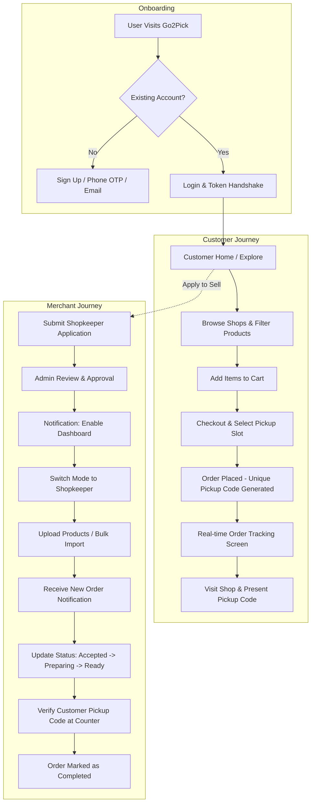
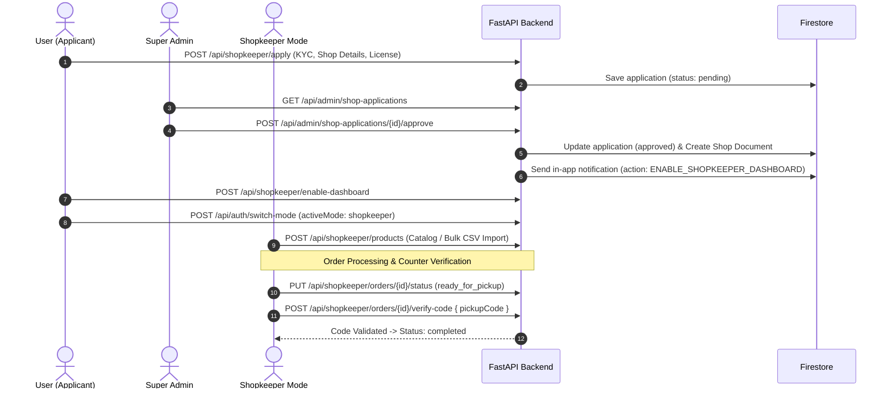

# 🛍️ Go2Pick — Comprehensive Project Overview & Website Workflow Blueprint

## 1. Executive Summary & Core Mission
**Go2Pick** is a pickup-only local commerce & pre-order platform. It connects neighbourhood retail shops (groceries, bakeries, pharmacies, daily essentials) with local customers who want to pre-order items in advance, bypass checkout lines, and pick up ready-packed parcels at the shop counter using a secure Pickup Verification Code.

### Key Value Propositions
- **Zero Waiting Time for Customers**: Browse shop inventory, add items to cart, select a pickup time window, and collect without queueing.
- **No Delivery or Payment Gateway Friction**: Designed as a lean, cash-on-pickup / counter-settlement MVP that eliminates delivery logistics and online payment gateway overheads.
- **Dual-Mode User Experience**: A single customer account can apply to become a merchant; once approved by the Super Admin, the user can toggle seamlessly between Customer Mode and Shopkeeper Mode.
- **Super Admin Governance**: Centralised administrative hub for KYC verification, shop approvals/suspensions, order auditing, platform health monitoring, and dispute resolution.

---

## 2. Technology Stack & Architectural Topology
```
┌────────────────────────────────────────────────────────────────────────┐
│                          Go2Pick Client Layer                          │
├───────────────────────────────────┬────────────────────────────────────┤
│   React 18 + Vite Web App         │   React Native (Expo) Mobile App   │
│   (Admin Panel & Web Portal)      │   (Customer & Merchant App)        │
│   • Tailwind CSS + Stitch UI      │   • Expo Router + Lucide Icons     │
│   • Context API (Auth, App, Cart) │   • Native Async Storage           │
└─────────────────┬─────────────────┴─────────────────┬──────────────────┘
                  │                                   │
                  ▼                                   ▼
┌────────────────────────────────────────────────────────────────────────┐
│                        FastAPI REST API Backend                        │
│  (Python 3.12, Pydantic v2, Uvicorn, JWT + Firebase Admin Auth)        │
├───────────────────┬───────────────────┬────────────────────────────────┤
│ /api/auth         │ /api/customer     │ /api/shopkeeper                │
│ /api/admin        │ /api/notifications│ /api/uploads & /api/support    │
└───────────────────┴─────────┬─────────┴────────────────────────────────┘
                              │
                              ▼
┌────────────────────────────────────────────────────────────────────────┐
│                        Data & Storage Tier                             │
├─────────────────────────┬──────────────────────┬───────────────────────┤
│ Google Cloud Firestore  │ Cloudinary CDN       │ Firebase Auth         │
│ (Users, Shops, Products,│ (Images, documents,  │ (Phone OTP & Token    │
│  Orders, Notifications) │  local fallback)     │  Verification)        │
└─────────────────────────┴──────────────────────┴───────────────────────┘
```

---

## 3. User Roles & Permission Hierarchy

| Role | Access Level | Description |
| :--- | :---: | :--- |
| **Guest / Visitor** | Public Read | Can browse landing page, search shops, view categories, and preview product catalogs. |
| **Customer** | Authenticated User | Can manage personal profile, cart, place pickup orders, track orders in real-time, cancel placed orders, view order history, and submit shop reviews. |
| **Shopkeeper (Merchant)** | Multi-role Mode | Customer whose shop application has been approved by the Super Admin and activated. Manages inventory, incoming orders, code verification, reports, and shop profile. |
| **Super Admin** | Platform Administrator | Complete oversight: approves/rejects shopkeeper applications, manages users/shops, reviews platform financials, handles support tickets, audits system logs and health. |

---

## 4. End-to-End Website Workflows

### Master System Flowchart


### Workflow 1: Authentication, Onboarding & Mode Switching
- **User Registration & Login**: Users authenticate via Firebase Phone Authentication (OTP) or standard Email & Password. On signup, a Firestore `users` document is created with default role `customer`.
- **Session Hydration**: Client captures Firebase ID Token or API JWT. Centralized Axios interceptor in `api.js` appends `Authorization: Bearer <token>` to all HTTP requests. `AuthContext` calls `/api/auth/me` to hydrate user role, approval status, active mode, and permissions.
- **Dual Mode Switch**: When approved (`isShopkeeper === true` and `shopkeeperStatus === 'approved'`), the user can call `POST /api/auth/switch-mode` with `{ activeMode: "shopkeeper" | "customer" }`. The app dynamically switches navigation, routing guards, and headers between Customer Portal and Shopkeeper Merchant Hub.

### Workflow 2: Customer Ordering & Pickup Lifecycle
```
[Explore Shops / Categories] 
         ↓
  [View Shop Catalog] 
         ↓
  [Add to Cart] (Single Shop Validation)
         ↓
[Checkout & Select Pickup Slot] 
         ↓
[Order Generated] ─── Unique Pickup Code (e.g. #7821 / 6-char hex)
         ↓
[Live Order Tracking] ─── Status Updates (Placed → Accepted → Preparing → Ready)
         ↓
[Shop Arrival & Code Presentation] ─── Counter Verification
         ↓
 [Order Completed] ─── Review & Rating Submission
```
- **Discovery & Exploration**: Customer home showcases featured stores, categories (Groceries, Bakery, Fresh Produce, Medicine), and top-rated merchants. Search and Explore filter by category, distance, rating, and keyword search.
- **Product Selection & Cart Management**: Stock levels and unit metrics (`kg`, `pcs`, `pack`) are validated. **Cart Isolation** enforces pickup from a single specific shop per order to avoid multi-shop pickup conflicts.
- **Order Placement & Code Generation**: At checkout, customer specifies estimated pickup time and notes. Backend generates a unique Pickup Code (`pickupCode`) and sets status as `placed`. In-app notification is sent to the shopkeeper.
- **Order Tracking & Collection**: Customer monitors real-time order status progress stepper on `OrderTracking.jsx`. Prominent Verification Code card displays the code for presentation at the shop counter. If needed, placed orders can be cancelled by the customer prior to acceptance.
- **Post-Pickup Review**: Once completed, customer submits 1–5 star ratings and reviews (`MyReviews.jsx`, `ShopReviews.jsx`).

### Workflow 3: Shopkeeper Onboarding, Operations & Verification

- **Merchant KYC Application**: User navigates to `/register-shop`, enters shop name, category, address, phone number, operating hours, and uploads business registration proof.
- **Dashboard Activation (Two-Step Security)**: Super Admin approves application. System sends an in-app notification with `actionType: ENABLE_SHOPKEEPER_DASHBOARD`. User clicks the notification, executing `POST /api/shopkeeper/enable-dashboard` to acknowledge and enable shopkeeper privileges.
- **Product & Inventory Management**: Form with image upload, pricing, description, stock count, and categories (`AddEditProduct.jsx`) or bulk CSV/Excel import (`BulkProductImportSheet.jsx`).
- **Order Fulfillment & Counter Verification**: Merchant views incoming orders on `ShopkeeperOrders.jsx`. Can accept or reject incoming orders. Flow: `placed` ➔ `accepted` ➔ `preparing` ➔ `ready_for_pickup`. At counter, merchant inputs the customer's code via `POST /api/shopkeeper/orders/{id}/verify-code` to mark order `completed`.

### Workflow 4: Super Admin Platform Administration
- **Global Dashboard**: Real-time metrics: Gross Merchandise Value (GMV), active shops, order completion rates, top performing categories, and user growth charts.
- **Shop Application & Approval Hub**: Review submitted documentation, contact details, and location. One-click Approve / Reject with rejection reason feedback.
- **Store & Merchant Moderation**: Toggle store status (Active / Inactive / Suspended) to hide non-compliant shops from public listings.
- **User Management**: Inspect registered users, filter by role (customer, shopkeeper, admin), and block/unblock accounts.
- **Support Ticket Resolution**: Omnichannel ticket management for dispute mediation between customers and merchants.
- **System Health & Audit Logs**: Real-time tracking of database connectivity, API latencies, security actions, and merchant activity logs.

---

## 5. Order State Machine Rules

The backend strictly enforces the order status transition graph in `app/routers/shopkeeper.py` and `app/routers/customer.py`:

```
┌────────┐       ┌──────────┐       ┌───────────┐       ┌──────────────────┐       ┌───────────┐
│ placed │ ───>  │ accepted │ ───>  │ preparing │ ───>  │ ready_for_pickup │ ───>  │ completed │
└────────┘       └──────────┘       └───────────┘       └──────────────────┘       └───────────┘
    │                 │                   │
    ▼                 ▼                   ▼
┌───────────────────────────────────────────────┐
│                   cancelled                   │
└───────────────────────────────────────────────┘
```

### Valid Status Transitions:
- `placed` ➔ `accepted` OR `cancelled`
- `accepted` ➔ `preparing` OR `cancelled`
- `preparing` ➔ `ready_for_pickup` OR `cancelled`
- `ready_for_pickup` ➔ `completed` (*Requires valid pickup code verification via `POST /orders/{id}/verify-code`; manual status override blocked*)
- **Terminal States**: `completed`, `cancelled` (no further transitions permitted).
- Any transition outside these defined paths returns an **HTTP 400 Bad Request**.

---

## 6. Directory & Codebase Navigation Map

| Component | Key Files |
| :--- | :--- |
| **App Routing & Guards** | `admin-panel/src/App.jsx` (`PrivateRoute`, `ShopkeeperRoute`, `AdminRoute`) |
| **State Management** | `admin-panel/src/context/AuthContext.jsx`, `AppContext.jsx`, `CartContext.jsx` |
| **API Client & Interceptors** | `admin-panel/src/services/api.js` |
| **Customer Pages** | `admin-panel/src/pages/stitch/CustomerHome.jsx`, `ShoppingCart.jsx`, `OrderTracking.jsx`, `ShopReviews.jsx`, `MyReviews.jsx` |
| **Merchant Pages** | `admin-panel/src/pages/stitch/ShopkeeperDashboard.jsx`, `ShopkeeperOrders.jsx`, `BulkProductImportSheet.jsx`, `AddEditProduct.jsx` |
| **Super Admin Pages** | `admin-panel/src/pages/stitch/GlobalDashboard.jsx`, `ShopApprovals.jsx`, `UserManagementwithNavDrawer.jsx`, `ShopManagement.jsx` |
| **Backend Core** | `backend/app/main.py`, `database.py`, `auth.py`, `config.py` |
| **Backend Routers** | `backend/app/routers/` (`customer.py`, `shopkeeper.py`, `admin.py`, `auth.py`, `notifications.py`, `support.py`) |

---

## 7. How to Run the Complete Website Locally

### Start the FastAPI Backend:
```bash
cd "Go2Pick/backend"
python -m venv venv
.\venv\Scripts\activate
pip install -r requirements.txt
python run.py
```
- **Backend API Live**: `http://localhost:8000`
- **Interactive Swagger Docs**: `http://localhost:8000/docs`

### Start the Admin & Storefront Web App:
```bash
cd "Go2Pick/admin-panel"
npm install
npm run dev
```
- **Web Application Live**: `http://localhost:5173` (or assigned Vite port)
